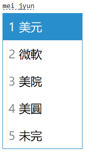

# Windows 10 theme for RIME (Windows 10 小須管、小狼毫皮膚)



## Install method (安裝方法):

1. Right click on the input method tray icon -> 用戶文件夾, the directory is also by default at `%AppData%/Rime` in Windows.

    在 RIME 輸入法圖示上右按 -> 用戶文件夾，文件夾的預設位置也可以以 `%AppData%/Rime` (Windows) 到達。
2. Edit the config file inside that folder: `squirrel.custom.yaml` (in Mac) or `weasel.custom.yaml` (in Windows).
    
    修改配設文件：`squirrel.custom.yaml` (Mac) or `weasel.custom.yaml` (Windows)。
3. Open [the Windows theme YAML](win_theme.yaml), and edit your config file:

    打開 [Windows 皮膚 YAML](win_theme.yaml), 然後修改你的配設文件

    1. If you already have the "patch" section (from `patch:` to the rest of the indented lines after the label), replace that with the entire theme.
    
        如果你已有 "patch" 這段代碼（由 `patch:` 至這標籤後所有縮入代碼行），就以整個皮膚檔案把這段碼覆蓋。
    
        Example "patch" region: (範例 "patch" 代碼範圍)
    
        ```
        patch:
          style/color_scheme: windows10
        ```
    
    2. If you do not have the "patch" section, just paste the entire Win theme content after the end in your config file.
        
        如果你沒有 "patch" 這段代碼，則把整個 Windows 皮膚內容貼上在你的配設文件後。
